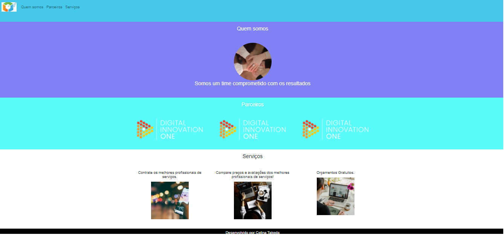

# Bootstrap
 
Bootstrap é um framework CSS utilizado em aplicações front-end, na camada de interface com o usuário para o desenvolvimento de aplicações adaptáveis á tela
de qualquer dispositivo.

São componentes prontos para ser usado no seu site.

    

